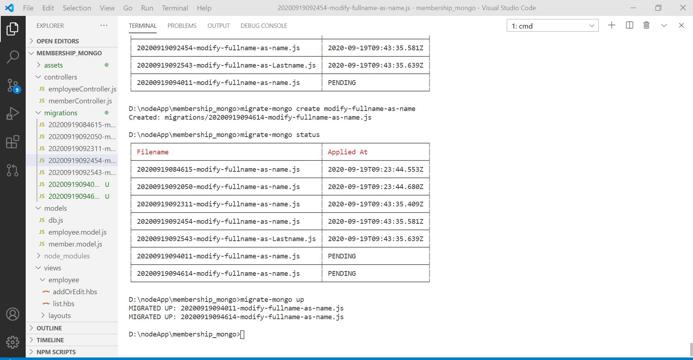
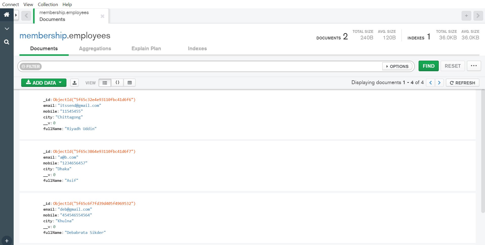
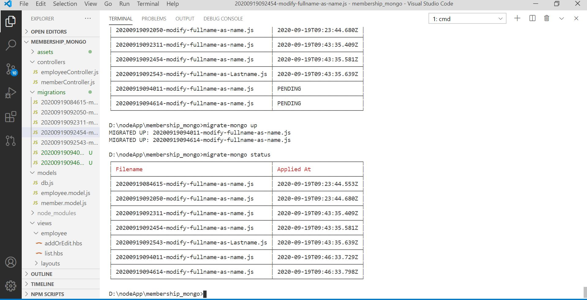
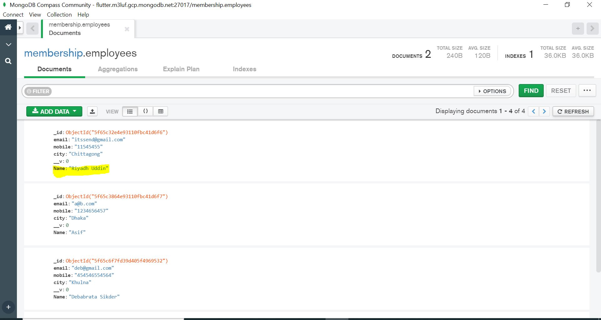
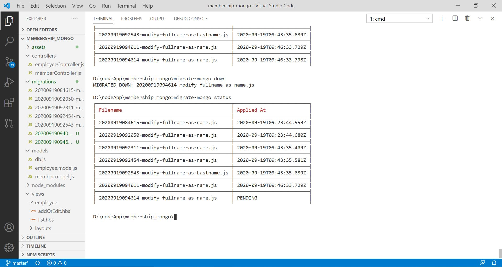
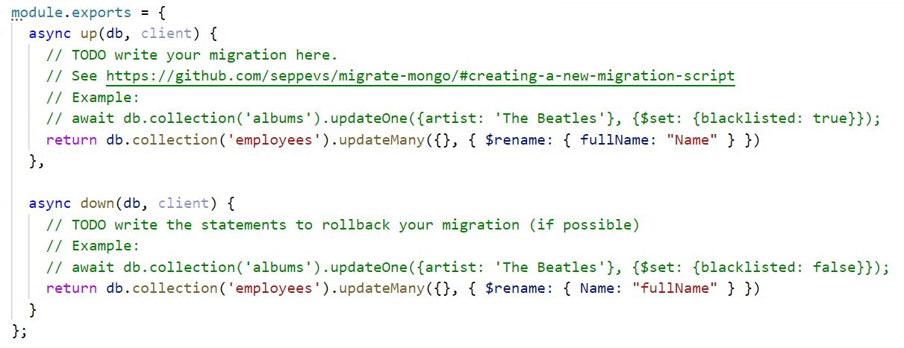
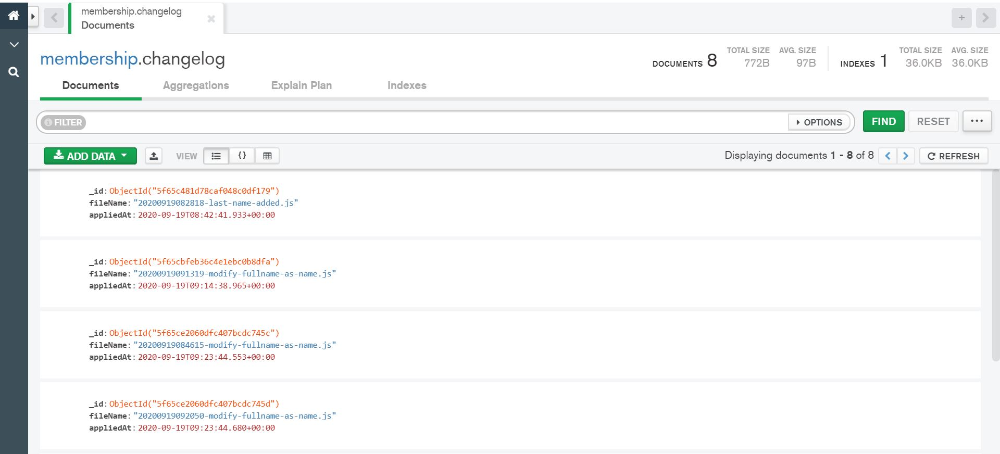

# Mongodb database migration on top of nodejs and express js
* Schema is very simple: Create a table with 
1. auto_id
2. email
3. mobile
4. city
5. fullname

## Now our migration script will modify 'Full Name' as name or 'Last Name';
migration script will load from migration folder. For this we need migrate-mongo.

    npm install -g migrate-mongo

Initialize a  migrate-mongo project and configure db
migrate-mongo init

#### now create migration script:
            migrate-mongo create modify-fullname-as-name 
            
   

Collection before migration

Running Migration

Migration Result

Rollback

### Modify default script

# Run migration up and down check status

    migrate-mongo up 
    migrate-mongo status
    migrate-mongo down

# The mongodb collection where the applied changes are stored. 

